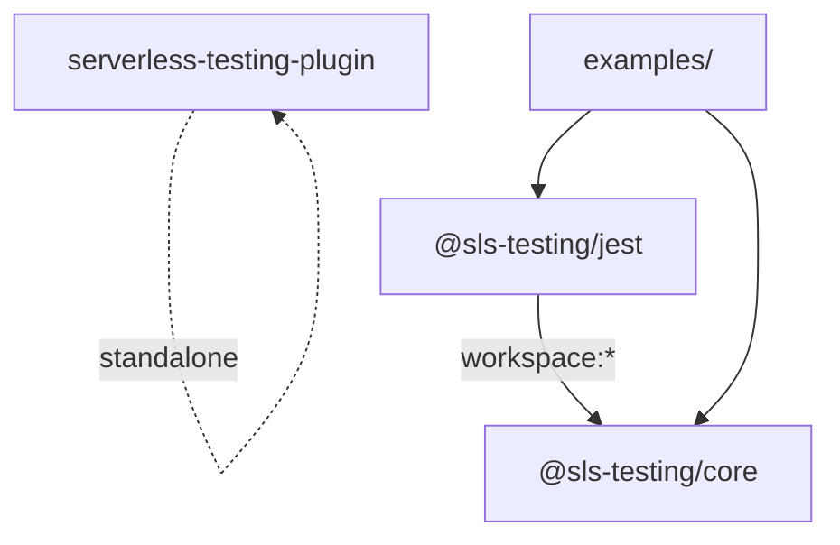
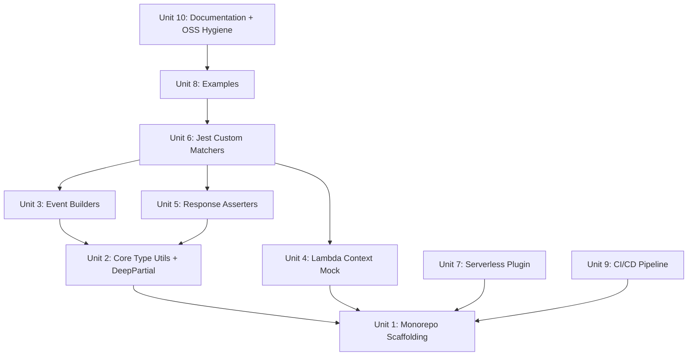

# feat: Implement @sls-testing v1 MVP — Serverless Testing Utilities

## Overview

Build and publish `@sls-testing` — an open-source monorepo of typed, composable testing utilities for AWS Lambda. The v1 MVP includes three packages (`@sls-testing/core`, `@sls-testing/jest`, `serverless-testing-plugin`), CI/CD pipeline, examples, and documentation. Designed to complement the *Testing Serverless Applications (TDD in the Real World)* ebook.

## Problem Frame

Every serverless developer writes the same testing boilerplate: building event payloads, mocking Lambda context, asserting response shapes. Existing libraries (`@serverless/event-mocks`, `aws-lambda-test-utils`) are unmaintained, lack TypeScript generics, don't support API Gateway v2, and require manual `JSON.stringify()` for bodies. There is no library that provides typed, auto-generating builders with realistic metadata — leaving a clear gap in the ecosystem. (see origin: `sls-testing-prod-spec.md`)

## Requirements Trace

- R1. Event builders for 7 trigger types: API GW v1, API GW v2, SQS, S3, EventBridge, SNS, DynamoDB Streams
- R2. Lambda context mock with `getRemainingTimeInMillis()` override for timeout testing
- R3. Response asserters: API response, SQS batch, Lambda error (core); side-effect detection (jest)
- R4. Jest custom matchers wrapping core asserters with full TypeScript type extensions
- R5. Serverless Framework plugin exposing function metadata + env loading
- R6. All packages written in TypeScript, compiled to dual CJS + ESM
- R7. 100% test coverage on core package
- R8. CI via GitHub Actions, automated npm publish via Changesets
- R9. Runnable examples per trigger type
- R10. READMEs (root + per-package)

## Scope Boundaries

- Node.js/TypeScript only (no Python/Go)
- No test runner bundled — Jest/Vitest agnostic at core level
- No AWS SDK call mocking — out of scope (use `@aws-sdk/client-mock`)
- No deployment tooling
- No docs site (v1.1 roadmap)
- No Vitest adapter (v2.0 roadmap)

## Context & Research

### Relevant Patterns and Ecosystem

- **@types/aws-lambda v8.10.161** — canonical type definitions. All event types importable from top-level `"aws-lambda"`. Key: v1 uses `APIGatewayProxyEvent`, v2 uses `APIGatewayProxyEventV2`. DynamoDB types are overly permissive (all optional) despite Lambda always populating core fields at runtime.
- **Existing libraries are stale** — `@serverless/event-mocks` (last commit Jan 2023) uses string-based event selectors with no type safety on overrides. `aws-lambda-test-utils` has no TypeScript. `sls-test-tools` focuses on deployed integration testing, not local event building.
- **Ecosystem gaps this library fills:** typed builders with `DeepPartial<>` generics, separate v1/v2 API Gateway support, auto-serialization of body objects, auto-generated realistic metadata (UUIDs, timestamps, ARNs), SQS batch builder with per-record ID generation, context mock with timeout override.

### External Best Practices

- **Monorepo:** pnpm 9+ with `workspace:*` protocol + Turborepo (`tasks` key, not deprecated `pipeline`). TypeScript project references with `composite: true`. Never use `tsconfig.paths` for cross-package imports — use `exports` field.
- **Bundling:** tsup with `format: ['cjs', 'esm']`, `dts: true`. Validate with `@arethetypeswrong/cli` in CI.
- **Package.json exports:** `types` condition MUST come first. Use `.d.cts` for CJS types, `.d.ts` for ESM. Keep top-level `main`/`module`/`types` for backward compat.
- **Jest matchers:** Triple declaration merge pattern (Matchers + Expect + InverseAsymmetricMatchers). Ship setup file for `setupFilesAfterEnv`.
- **Versioning:** Changesets with `fixed` grouping for core+jest (always same version). `access: "public"` for scoped packages.
- **CI:** npm OIDC trusted publishing (no NPM_TOKEN secret). Matrix test on Node 20 + 22. Turborepo `--filter='...[origin/main]'` for PR-scoped CI.

## Key Technical Decisions

- **tsup over tsc/unbuild for bundling:** Best DX for TS library publishing in 2026. Handles CJS+ESM+dts in one pass. Rolldown-based alternatives (tsdown) not mature enough yet.
- **DeepPartial<T> for builder overrides:** Standard `Partial<>` only makes first-level optional. Event types like `requestContext` have deeply nested required fields — `DeepPartial` lets users override any nested field without providing the full tree.
- **Separate v1 and v2 API Gateway builders:** The types are fundamentally different (v1: `httpMethod`/`path`/`resource`; v2: `rawPath`/`routeKey`/`requestContext.http`). A unified builder would sacrifice type safety.
- **Auto-serialize body objects to JSON string:** Accept plain objects in builder input and `JSON.stringify()` internally. Every existing library forces manual serialization — this is a key DX differentiator.
- **`fixed` Changesets grouping for core+jest:** These packages are tightly coupled (jest wraps core). Synchronized versions prevent mismatched peer dependencies. Plugin versioned independently.
- **`"type": "module"` with dual CJS output:** Forward-looking ESM-first, with CJS for backward compat. tsup handles the `.cjs`/`.js` split.
- **OIDC trusted publishing over NPM_TOKEN:** Short-lived tokens per publish, no secret leakage risk. GA since July 2025.
- **`@types/aws-lambda` as peer dependency:** Avoids version conflicts with consumers who already have it installed (which is every Lambda developer). Use broad range `>=8.10.0` as peer dep, pinned version as dev dep in the monorepo.
- **`assertNoSideEffects` lives in jest package, not core:** The spy interface (`.mock.calls.length`) is Jest-specific. Putting it in core would violate the framework-agnostic boundary and complicate the Vitest adapter (v2.0 roadmap). Define a `SpyLike` interface in the jest package instead.
- **Builders are pass-through (no input validation):** Builders do not validate override values. If a user passes `httpMethod: undefined`, the event will contain that value. This is intentional — test utilities should let users construct invalid events to test error handling. Documented in READMEs.
- **Core asserters do plain deep-partial matching; Jest matchers handle asymmetric matchers:** The product spec shows `bodyContains: { userId: expect.any(String) }`, but `expect.any()` is Jest-specific. Core's `assertApiResponse` does plain object deep-partial matching. The Jest matcher `toMatchLambdaResponse` uses Jest's `this.equals()` for body matching, which natively handles asymmetric matchers. This preserves core's framework-agnostic boundary.
- **Two-phase build for array-record builders (SQS, DynamoDB, SNS):** Record expansion (simplified input → full record) happens *before* `deepMerge`, not via it. Pattern: (1) expand simplified records into full records with per-record defaults, (2) construct the complete event, (3) apply remaining top-level overrides via `deepMerge`. This avoids nonsensical array merging.
- **`setupServerlessTesting` returns a cleanup function:** Avoids leaked global state (`process.env.TZ`, `console` mocks). Consumer calls `const cleanup = setupServerlessTesting({...})` in `beforeAll` and `cleanup()` in `afterAll`.

## Open Questions

### Resolved During Planning

- **v1 vs v2 API Gateway in same builder?** — Separate builders (`buildApiGatewayV1Event`, `buildApiGatewayV2Event`). The convenience alias `buildApiGatewayEvent` maps to v2 (HTTP API) as the modern default.
- **How to handle DynamoDB AttributeValue construction?** — Provide a lightweight `marshall()` helper or accept pre-marshalled values. Avoid depending on `@aws-sdk/util-dynamodb` to keep the package lightweight. Implement a minimal marshaller for common types (string, number, boolean, map, list, null).
- **Jest type declarations pattern?** — Use the triple declaration merge pattern from `jest-dom`/`jest-extended`. Define `CustomMatchers<R>` interface once, extend `Matchers`, `Expect`, and `InverseAsymmetricMatchers`.
- **Where does `assertNoSideEffects` live?** — In `@sls-testing/jest`, not core. It requires a spy interface which is framework-specific. Core remains framework-agnostic.
- **How does `bodyContains` support `expect.any()` and friends?** — Core does plain deep-partial matching. Jest matchers use `this.equals()` for body comparison, which natively handles asymmetric matchers. The matchers layer adds this capability, not core.
- **How does `succeededCount` work in `assertSQSBatchResponse`?** — Removed from the core asserter. `SQSBatchResponse` only contains `batchItemFailures` — there is no concept of "total records" in the response type. Users assert on `failedMessageIds` (exact set match) and `toHaveNoFailedMessages()`. If they need to verify total count, they compare against the original event's `Records.length`.
- **`rawQueryString` vs `queryStringParameters` conflict in v2 builder?** — If only `queryStringParameters` is provided, `rawQueryString` is auto-derived. If only `rawQueryString` is provided, it takes precedence. If both are provided, `rawQueryString` wins (it is the canonical source in v2).

### Deferred to Implementation

- **Exact deep merge implementation:** Whether to use a vendored `deepmerge` or write a minimal recursive merge. Decision depends on edge cases discovered during builder testing (e.g., handling of Date objects, RegExp).
- **Serverless plugin `sls test` command ergonomics:** Exact CLI flag design depends on integration testing with Serverless Framework v3/v4.
- **LocalStack integration test configuration:** Setup depends on LocalStack version and Docker compose details at implementation time.

## High-Level Technical Design

> *This illustrates the intended approach and is directional guidance for review, not implementation specification. The implementing agent should treat it as context, not code to reproduce.*

### Package Dependency Graph



> **Note:** `serverless-testing-plugin` is independent of `@sls-testing/core` — it reads Serverless Framework metadata, not event builders. It can be versioned and released independently.

### Event Builder Pattern

```
buildXxxEvent(overrides?: DeepPartial<XxxEvent>): XxxEvent
  1. Create DEFAULTS object with all required fields populated
     - Generate UUIDs for IDs (awsRequestId, messageId)
     - Generate ISO timestamps
     - Derive ARNs from names
     - Set event source constants ("aws:sqs", "aws:s3", etc.)
  2. Apply user overrides via recursive deep merge
     - Special handling: if body is object, JSON.stringify it
     - Special handling: if SQS records array provided, expand each to full SQSRecord
  3. Return fully-typed event object
```

### Response Asserter Pattern

```
assertXxx(response, expectations):
  1. Validate response shape matches expected type
  2. Check each expectation field:
     - statusCode: exact match
     - bodyContains: deep partial match (parse JSON body first)
     - headers: subset match (case-insensitive keys)
     - failedMessageIds: exact set match
  3. Throw descriptive assertion error with diff on mismatch
```

### Jest Matcher Wiring

```
@sls-testing/jest imports @sls-testing/core asserters
  -> Wraps each asserter in Jest matcher signature { pass, message }
  -> Registers via expect.extend()
  -> Ships jest.d.ts with triple declaration merge for type safety
  -> Consumer adds to setupFilesAfterEnv or imports directly
```

## Implementation Units

### Dependency Flow



---

- [ ] **Unit 1: Monorepo Scaffolding**

**Goal:** Set up the pnpm workspace, Turborepo, TypeScript configuration, and tsup build pipeline for all three packages.

**Requirements:** R6 (TypeScript, dual CJS+ESM)

**Dependencies:** None

**Files:**
- Create: `pnpm-workspace.yaml`
- Create: `turbo.json`
- Create: `tsconfig.base.json`
- Create: `package.json` (root)
- Create: `packages/core/package.json`
- Create: `packages/core/tsconfig.json`
- Create: `packages/core/tsup.config.ts`
- Create: `packages/core/src/index.ts` (barrel export, initially empty)
- Create: `packages/jest/package.json`
- Create: `packages/jest/tsconfig.json`
- Create: `packages/jest/tsup.config.ts`
- Create: `packages/jest/src/index.ts`
- Create: `packages/serverless-plugin/package.json`
- Create: `packages/serverless-plugin/tsconfig.json`
- Create: `packages/serverless-plugin/tsup.config.ts`
- Create: `packages/serverless-plugin/src/index.ts`
- Create: `.changeset/config.json`
- Create: `.gitignore`
- Create: `.npmrc`

**Approach:**
- Root `package.json` with `"private": true`, scripts for `build`, `test`, `lint`, `check-types`
- `pnpm-workspace.yaml` declaring `packages/*`
- `turbo.json` using `tasks` key: `build` with `dependsOn: ["^build"]`, `test` with `dependsOn: ["build"]`, `lint` and `check-types`
- `tsconfig.base.json` with strict mode, `target: "ES2022"`, `moduleResolution: "bundler"`, `composite: true`
- Each package's `tsconfig.json` extends base, adds project references where needed
- Each package's `package.json` with `"type": "module"`, proper `exports` field (`types` first in each condition), top-level `main`/`module`/`types` for backward compat
- tsup config: `format: ['cjs', 'esm']`, `dts: true`, `clean: true`, `sourcemap: true`
- `@sls-testing/jest` declares `@sls-testing/core` as `"workspace:*"` dependency
- `serverless-testing-plugin` declares `@sls-testing/core` as `"workspace:*"` dependency
- Changesets config with `fixed: [["@sls-testing/core", "@sls-testing/jest"]]`, `access: "public"`
- `@types/aws-lambda` as `peerDependency: ">=8.10.0"` in core's `package.json`, pinned as `devDependency` in root
- `.npmrc` with `shamefully-hoist=false`
- Include a skeleton `.github/workflows/ci.yml` (build + type-check only, no tests yet) so CI feedback starts from the first unit

**Patterns to follow:**
- Turborepo official `tasks` configuration (not deprecated `pipeline`)
- pnpm `workspace:*` protocol for inter-package deps
- `@arethetypeswrong/cli` pattern for exports validation

**Test scenarios:**
- Happy path: `pnpm install` succeeds, `pnpm turbo run build` compiles all 3 packages to `dist/` with both `.js` and `.cjs` outputs
- Happy path: Each package's `dist/` contains `.d.ts` and `.d.cts` declaration files
- Edge case: `@arethetypeswrong/cli --pack` passes for each package (no module resolution issues)

**Verification:**
- `pnpm turbo run build` completes without errors
- Each package has `dist/index.js`, `dist/index.cjs`, `dist/index.d.ts`, `dist/index.d.cts`
- Cross-package imports resolve correctly (jest imports core)

---

- [ ] **Unit 2: Core Type Utilities and DeepPartial**

**Goal:** Implement the foundational type utilities used by all event builders — `DeepPartial<T>`, deep merge function, UUID generator, and common defaults (region, account, timestamps).

**Requirements:** R1 (foundation for builders), R6 (TypeScript)

**Dependencies:** Unit 1

**Files:**
- Create: `packages/core/src/types.ts`
- Create: `packages/core/src/utils/deep-merge.ts`
- Create: `packages/core/src/utils/generators.ts`
- Create: `packages/core/src/utils/index.ts`
- Create: `packages/core/src/utils/deep-partial-match.ts`
- Test: `packages/core/src/__tests__/utils/deep-merge.test.ts`
- Test: `packages/core/src/__tests__/utils/deep-partial-match.test.ts`
- Test: `packages/core/src/__tests__/utils/generators.test.ts`

**Approach:**
- `DeepPartial<T>` — recursive mapped type making all nested properties optional. Handle arrays, Date, and primitive leaf types as non-recursive.
- `deepMerge(target, source)` — recursive merge that: preserves unset nested fields, replaces arrays (not concatenating), handles `null`/`undefined` correctly. Keep it minimal — no external dependency.
- `deepPartialMatch(actual, expected): { pass: boolean, diff?: string }` — recursive partial matching for asserters. Checks that every key in `expected` exists in `actual` with matching values. Returns a structured diff on mismatch. Shared by both builders (internal validation) and asserters (`bodyContains`).
- `generators.ts` — `generateUUID()` (crypto.randomUUID or fallback), `generateTimestamp()` (ISO 8601), `generateArn(service, resource)`, `generateRequestId()`
- Common defaults: `DEFAULT_REGION = 'us-east-1'`, `DEFAULT_ACCOUNT_ID = '123456789012'`

**Patterns to follow:**
- TypeScript utility type patterns from `type-fest` (reference, not dependency)

**Test scenarios:**
- Happy path: `DeepPartial` makes nested fields optional — override `requestContext.http.method` without providing full `requestContext`
- Happy path: `deepMerge` combines two objects with nested properties, preserving unset fields
- Edge case: `deepMerge` with `null` source value replaces target field with `null`
- Edge case: `deepMerge` replaces arrays entirely (no concatenation)
- Edge case: `deepMerge` with empty object source leaves target unchanged
- Edge case: `deepMerge` with undefined values in source are skipped (don't overwrite target)
- Happy path: `generateUUID()` returns valid UUID v4 format
- Happy path: `generateTimestamp()` returns valid ISO 8601 string
- Happy path: `generateArn('lambda', 'my-function')` returns `arn:aws:lambda:us-east-1:123456789012:function:my-function`
- Happy path: `deepPartialMatch({ a: 1, b: { c: 2, d: 3 } }, { b: { c: 2 } })` — passes (partial match)
- Error path: `deepPartialMatch({ a: 1 }, { a: 2 })` — returns `{ pass: false }` with diff showing expected 2 but got 1
- Edge case: `deepPartialMatch({ a: [1, 2] }, { a: [1, 2] })` — exact array match (not partial)
- Edge case: `deepPartialMatch({ a: null }, { a: null })` — null matches null

**Verification:**
- All utility tests pass
- `DeepPartial<APIGatewayProxyEventV2>` compiles correctly (type-level check)

---

- [ ] **Unit 3: Event Builders**

**Goal:** Implement all 6 event builder factory functions with typed overrides, auto-serialization, and realistic defaults.

**Requirements:** R1 (all 6 event types), R7 (100% coverage)

**Dependencies:** Unit 2

**Files:**
- Create: `packages/core/src/builders/api-gateway-v1.ts`
- Create: `packages/core/src/builders/api-gateway-v2.ts`
- Create: `packages/core/src/builders/sqs.ts`
- Create: `packages/core/src/builders/s3.ts`
- Create: `packages/core/src/builders/eventbridge.ts`
- Create: `packages/core/src/builders/sns.ts`
- Create: `packages/core/src/builders/dynamodb-stream.ts`
- Create: `packages/core/src/builders/index.ts`
- Create: `packages/core/src/builders/marshall.ts` (lightweight DynamoDB AttributeValue helper)
- Test: `packages/core/src/__tests__/builders/api-gateway-v1.test.ts`
- Test: `packages/core/src/__tests__/builders/api-gateway-v2.test.ts`
- Test: `packages/core/src/__tests__/builders/sqs.test.ts`
- Test: `packages/core/src/__tests__/builders/s3.test.ts`
- Test: `packages/core/src/__tests__/builders/eventbridge.test.ts`
- Test: `packages/core/src/__tests__/builders/sns.test.ts`
- Test: `packages/core/src/__tests__/builders/dynamodb-stream.test.ts`
- Test: `packages/core/src/__tests__/builders/marshall.test.ts`
- Modify: `packages/core/src/index.ts` (re-export builders)

**Approach:**
- Each builder follows the same pattern: `buildXxxEvent(overrides?: DeepPartial<XxxEvent>): XxxEvent`
- Default objects populate ALL required fields per the @types/aws-lambda type definitions
- `deepMerge(defaults, overrides)` produces the final event
- **API GW v1:** All fields required (many accept `null`). `body` defaults to `null`, `pathParameters`/`queryStringParameters` default to `null`. Full `requestContext` with `identity` (null Cognito fields). `resource` defaults to `"/{proxy+}"`.
- **API GW v2:** `version: "2.0"`, `rawQueryString: ""`. Optional fields (`body`, `pathParameters`, `queryStringParameters`, `cookies`) omitted from defaults. `requestContext.http` fully populated. Convenience: accept `method`, `path`, `body` as top-level shorthand and map to correct v2 locations.
- **SQS:** Accept simplified `{ records: [{ body: object }] }` — expand each to full `SQSRecord` with generated `messageId`, `receiptHandle`, `md5OfBody`, populated `attributes` (timestamps, `ApproximateReceiveCount: "1"`). Auto-`JSON.stringify` body objects.
- **S3:** Accept `{ bucket, key, eventName? }` — derive `bucket.arn` from name, generate request IDs, default `eventName` to `"ObjectCreated:Put"`, `eventVersion: "2.1"`.
- **EventBridge:** Generic `buildEventBridgeEvent<TDetail>(overrides)`. `version: "0"`, auto-generate `id`, `time`, `account`, `region`. Hyphenated keys (`detail-type`, `replay-name`) handled correctly.
- **SNS:** PascalCase fields per AWS runtime payload. Generate `MessageId`, `Timestamp`, `Signature`, `SigningCertUrl`, `UnsubscribeUrl`. Wrap in `SNSEventRecord` with `EventSource: "aws:sns"`.
- **DynamoDB Streams:** Despite types marking all fields optional, populate fields Lambda always sends (`eventID`, `eventName`, `eventSource`, `awsRegion`, `eventSourceARN`, `dynamodb.Keys`). Provide minimal `marshall()` helper for `AttributeValue` construction (string, number, boolean, map, list, null, binary).
- Convenience alias: `buildApiGatewayEvent` -> `buildApiGatewayV2Event` (modern default)

**Patterns to follow:**
- @types/aws-lambda type definitions as source of truth for field shapes
- Factory function pattern (not class/builder chain) per the product spec

**Test scenarios:**

*API Gateway v1:*
- Happy path: `buildApiGatewayV1Event()` with no args returns complete, type-safe event with all required fields
- Happy path: `buildApiGatewayV1Event({ httpMethod: 'POST', path: '/users', body: { name: 'Lucas' } })` — body auto-serialized to JSON string, `isBase64Encoded: false`
- Happy path: Override `pathParameters: { id: '42' }` replaces null default
- Happy path: Override nested `requestContext.identity.sourceIp` preserves other identity fields
- Edge case: `body: null` explicitly — stays null, not stringified
- Edge case: `body` as raw string — kept as-is, not double-stringified
- Edge case: Override `headers` merges with defaults (doesn't replace all)

*API Gateway v2:*
- Happy path: `buildApiGatewayV2Event()` returns event with `version: "2.0"`, `rawQueryString: ""`
- Happy path: `buildApiGatewayV2Event({ method: 'POST', path: '/users', body: { name: 'Lucas' } })` — shorthand mapped to `requestContext.http.method`, `rawPath`, body auto-serialized
- Happy path: Override `queryStringParameters: { page: '1', sort: 'desc' }` — `rawQueryString` auto-derived as `"page=1&sort=desc"`
- Edge case: Optional fields (`cookies`, `stageVariables`) absent from default (not null, truly absent)
- Edge case: `requestContext.stage` defaults to `"$default"`
- Edge case: Both `rawQueryString` and `queryStringParameters` provided — `rawQueryString` wins
- Edge case: `queryStringParameters` with special characters — URL-encoded in `rawQueryString`

*SQS:*
- Happy path: `buildSQSEvent({ records: [{ body: { orderId: 'abc' } }] })` — single record with generated `messageId`, serialized body, populated `attributes`
- Happy path: Batch with 3 records — each gets unique `messageId`, correct `eventSource: "aws:sqs"`
- Edge case: `body` as raw string — kept as-is
- Edge case: Empty records array — returns valid `SQSEvent` with empty `Records`

*S3:*
- Happy path: `buildS3Event({ bucket: 'my-bucket', key: 'uploads/image.png' })` — `eventName` defaults to `"ObjectCreated:Put"`, bucket ARN derived
- Happy path: Override `eventName: 'ObjectRemoved:Delete'`
- Edge case: Key with special characters (spaces, unicode) — preserved as-is

*EventBridge:*
- Happy path: `buildEventBridgeEvent({ source: 'app.orders', detailType: 'OrderPlaced', detail: { orderId: 'abc' } })` — auto-generated `id`, `time`, `version: "0"`
- Happy path: Generic type flows through — `detail` field matches provided type
- Edge case: `resources: []` default (empty array, not absent)

*SNS:*
- Happy path: `buildSNSEvent({ message: 'hello', topicArn: 'arn:aws:sns:...' })` — PascalCase fields, `Type: "Notification"`, generated `MessageId`
- Happy path: Message as object — auto-serialized
- Happy path: Multiple records — `buildSNSEvent({ records: [{ message: 'a' }, { message: 'b' }] })` — each gets unique `MessageId`
- Edge case: `Subject` omitted by default (optional field)

*DynamoDB Streams:*
- Happy path: `buildDynamoDBStreamEvent({ records: [{ eventName: 'INSERT', keys: { id: 'abc' }, newImage: { id: 'abc', name: 'Lucas' } }] })` — marshalled to AttributeValue format
- Happy path: `MODIFY` event with both `OldImage` and `NewImage`
- Happy path: `REMOVE` event with only `OldImage`
- Edge case: `KEYS_ONLY` StreamViewType — `NewImage` and `OldImage` absent
- Edge case: `marshall()` handles nested objects, arrays, numbers, booleans, null
- Edge case: `marshall()` handles Set types (`SS`, `NS`) for common DynamoDB patterns

- Integration: Barrel export contract test — import from `@sls-testing/core` (package entry point) and assert all public symbols (all builders, context mock, asserters) are accessible

**Verification:**
- All builder tests pass with 100% coverage
- Each builder's output matches the corresponding @types/aws-lambda type (TypeScript compilation check)
- Builders with no overrides produce events that pass `JSON.stringify`/`JSON.parse` roundtrip

---

- [ ] **Unit 4: Lambda Context Mock**

**Goal:** Implement the Lambda context mock factory with all required fields and `getRemainingTimeInMillis()` override.

**Requirements:** R2

**Dependencies:** Unit 1

**Files:**
- Create: `packages/core/src/context.ts`
- Test: `packages/core/src/__tests__/context.test.ts`
- Modify: `packages/core/src/index.ts` (re-export context builder)

**Approach:**
- `buildLambdaContext(overrides?: Partial<LambdaContextOptions>): Context`
- `LambdaContextOptions` extends the overridable fields plus `remainingTimeOverride: number`
- Default `functionName: 'test-function'`, `functionVersion: '$LATEST'`, `memoryLimitInMB: '128'` (string, not number — per AWS type)
- `awsRequestId`: auto-generated UUID
- `logGroupName`: derived as `/aws/lambda/${functionName}`
- `logStreamName`: derived as `YYYY/MM/DD/[$LATEST]${awsRequestId}`
- `invokedFunctionArn`: derived from function name
- `getRemainingTimeInMillis()`: returns `remainingTimeOverride` if set, otherwise a default (e.g., 30000ms)
- Deprecated methods (`done`, `fail`, `succeed`): implemented as no-ops
- `callbackWaitsForEmptyEventLoop`: defaults to `true`

**Patterns to follow:**
- @types/aws-lambda `Context` interface as the type contract

**Test scenarios:**
- Happy path: `buildLambdaContext()` returns valid Context with all required fields populated
- Happy path: `buildLambdaContext({ functionName: 'my-func' })` — `logGroupName` and `invokedFunctionArn` derived from overridden name
- Happy path: `buildLambdaContext({ remainingTimeOverride: 500 })` — `getRemainingTimeInMillis()` returns 500
- Happy path: `getRemainingTimeInMillis()` is callable (function, not static value)
- Edge case: `memoryLimitInMB` override as string `'512'` — kept as string
- Edge case: `done()`, `fail()`, `succeed()` are callable no-ops (no throw)
- Edge case: `awsRequestId` is unique across multiple calls (different UUIDs)
- Edge case: `getRemainingTimeInMillis()` called twice returns the same value (fixed, not a countdown) — documents the contract explicitly

**Verification:**
- Context output satisfies the `Context` type from `@types/aws-lambda`
- `getRemainingTimeInMillis()` returns expected value based on override

---

- [ ] **Unit 5: Response Asserters**

**Goal:** Implement framework-agnostic response assertion functions for API Gateway, SQS batch, and Lambda errors. Uses `deepPartialMatch` from Unit 2 for body matching.

**Requirements:** R3

**Dependencies:** Unit 2

**Files:**
- Create: `packages/core/src/asserters/api-response.ts`
- Create: `packages/core/src/asserters/sqs-batch.ts`
- Create: `packages/core/src/asserters/lambda-error.ts`
- Create: `packages/core/src/asserters/index.ts`
- Test: `packages/core/src/__tests__/asserters/api-response.test.ts`
- Test: `packages/core/src/__tests__/asserters/sqs-batch.test.ts`
- Test: `packages/core/src/__tests__/asserters/lambda-error.test.ts`
- Modify: `packages/core/src/index.ts` (re-export asserters)

**Approach:**
- `assertApiResponse(response, expectations)` — check `statusCode` (exact), `bodyContains` (deep partial match via `deepPartialMatch` after JSON parse), `headers` (subset, case-insensitive key match). Throw `AssertionError` with human-readable diff on mismatch.
- `assertSQSBatchResponse(response, expectations)` — validate `batchItemFailures` array. Check `failedMessageIds` (exact set match). No `succeededCount` — `SQSBatchResponse` has no total records concept; users compare against original event's `Records.length` if needed.
- `assertLambdaError(error, expectations)` — check error type, message pattern, and optional `statusCode` in structured error responses.
- **Note:** `assertNoSideEffects` lives in `@sls-testing/jest` (Unit 6), not core. The spy interface is framework-specific.
- All asserters return `void` on success, throw descriptive errors on failure. Error messages include expected vs actual with context.

**Patterns to follow:**
- Assertion error formatting similar to Jest's built-in matchers (expected/received)
- Reuse `deepPartialMatch` from Unit 2 for `bodyContains` matching

**Test scenarios:**

*assertApiResponse:*
- Happy path: Response `{ statusCode: 200, body: '{"id":"1"}' }` matches `{ statusCode: 200, bodyContains: { id: '1' } }`
- Happy path: Header check with case-insensitive keys — `content-type` matches `Content-Type`
- Error path: Status code mismatch — throws with "Expected status 200, received 404"
- Error path: Body partial match fails — throws with expected vs actual body diff
- Error path: Response body is not valid JSON and `bodyContains` is an object — throws clear error "Response body is not valid JSON"
- Edge case: `bodyContains` with string value — matches against raw body string
- Edge case: Response with no `body` field (e.g., 204 No Content) — `bodyContains` check skipped if body is undefined, fails if bodyContains is specified and body is missing

*assertSQSBatchResponse:*
- Happy path: Response with 1 failed message — `failedMessageIds: ['msg-2']` matches
- Happy path: Empty `batchItemFailures` — passes when asserting no failures
- Error path: Expected failed message ID not in response — descriptive error listing actual vs expected
- Edge case: `batchItemFailures` is undefined (all succeeded) — treated as empty array

*assertLambdaError:*
- Happy path: Error with matching type and message pattern
- Error path: Error type mismatch — throws with expected vs actual type
- Edge case: Structured error with `statusCode` field
- Edge case: Message as RegExp pattern — matches against error message

**Verification:**
- All asserter tests pass
- Assertion errors include actionable diff messages
- `bodyContains` uses `deepPartialMatch` from Unit 2 (not a parallel implementation)

---

- [ ] **Unit 6: Jest Custom Matchers**

**Goal:** Implement the `@sls-testing/jest` package with custom matchers wrapping core asserters, TypeScript type extensions, and a setup helper.

**Requirements:** R4

**Dependencies:** Units 3, 4, 5

**Files:**
- Create: `packages/jest/src/matchers/status-code.ts`
- Create: `packages/jest/src/matchers/lambda-response.ts`
- Create: `packages/jest/src/matchers/sqs-response.ts`
- Create: `packages/jest/src/matchers/side-effects.ts`
- Create: `packages/jest/src/matchers/index.ts`
- Create: `packages/jest/src/setup.ts`
- Create: `packages/jest/src/types/jest.d.ts`
- Create: `packages/jest/src/index.ts`
- Test: `packages/jest/src/__tests__/matchers/status-code.test.ts`
- Test: `packages/jest/src/__tests__/matchers/lambda-response.test.ts`
- Test: `packages/jest/src/__tests__/matchers/sqs-response.test.ts`
- Test: `packages/jest/src/__tests__/matchers/side-effects.test.ts`
- Test: `packages/jest/src/__tests__/matchers/setup.test.ts`
- Test: `packages/jest/src/__tests__/integration/core-delegation.test.ts`

**Approach:**
- Each matcher returns `{ pass: boolean, message: () => string }`. The `message` describes both pass and fail case (Jest uses inverse for `.not`). **Both message branches must be tested for every matcher.**
- Matchers use `this.utils` (from `jest-matcher-utils`) for formatting expected/received.
- `toMatchLambdaResponse` uses Jest's `this.equals()` for body matching (not core's `deepPartialMatch`), which natively handles asymmetric matchers like `expect.any(String)`. Other matchers delegate to core asserters.
- **Matchers:**
  - `toHaveStatusCode(expected: number)` — exact status code match
  - `toMatchLambdaResponse(expected)` — deep partial match on API Gateway response, body matching via `this.equals()`
  - `toBeSuccessfulApiResponse()` — status 2xx
  - `toBeClientError()` — status 4xx
  - `toBeServerError()` — status 5xx
  - `toHaveNoFailedMessages()` — SQS batch with empty failures
  - `toHaveFailedMessage(messageId: string)` — specific message in failures
  - `toHaveNoSideEffects()` — asserts spy/mock was not called (lives here, not in core, because it depends on Jest's spy interface)
- **Type declarations (`jest.d.ts`):** Define `CustomMatchers<R>` interface. Extend `jest.Matchers<R, T>`, `jest.Expect`, and `jest.InverseAsymmetricMatchers` via declaration merging.
- **Setup helper:** `setupServerlessTesting({ timezone?, suppressLogs? })` — sets `TZ` env var, optionally mocks `console.log`/`console.warn`. **Returns a cleanup function** that restores `process.env.TZ` and `console` methods. Consumer pattern: `const cleanup = setupServerlessTesting({...})` in `beforeAll`, `cleanup()` in `afterAll`.
- **Registration:** `setup.ts` calls `expect.extend(allMatchers)`. Consumers add to `setupFilesAfterEnv` or import `@sls-testing/jest`.

**Patterns to follow:**
- `@testing-library/jest-dom` for triple declaration merge pattern
- `jest-extended` for matcher registration and setup file pattern

**Test scenarios:**

*Status code matchers:*
- Happy path: `expect({ statusCode: 201 }).toHaveStatusCode(201)` — passes
- Happy path: `.not.toHaveStatusCode(200)` on `{ statusCode: 201 }` — passes
- Error path: `toHaveStatusCode(200)` on `{ statusCode: 404 }` — fails with "Expected status code 200, received 404"
- Error path: `.not.toHaveStatusCode(200)` on `{ statusCode: 200 }` — fails with clear inverse message

*Lambda response matcher:*
- Happy path: `toMatchLambdaResponse({ body: { id: '1' } })` on `{ statusCode: 200, body: '{"id":"1"}' }` — partial body match
- Happy path: `toMatchLambdaResponse({ body: { userId: expect.any(String) } })` — asymmetric matcher works via `this.equals()`
- Error path: Body matches but status code in expectation doesn't — clear error showing which field mismatched
- Error path: `.not.toMatchLambdaResponse(...)` when response *does* match — clear inverse message
- Edge case: Response with no `body` field — clear error when body expected

*Range matchers (2xx/4xx/5xx):*
- Happy path: `toBeSuccessfulApiResponse()` on 200, 201, 204 — all pass
- Happy path: `toBeClientError()` on 400, 404, 422 — all pass
- Happy path: `toBeServerError()` on 500, 502, 503 — all pass
- Error path: `toBeSuccessfulApiResponse()` on `{ statusCode: 500 }` — fails with "Expected 2xx, received 500"
- Error path: `.not.toBeSuccessfulApiResponse()` on `{ statusCode: 200 }` — fails with clear inverse message
- Edge case: Boundary values — 199 (not 2xx), 200 (2xx), 299 (2xx), 300 (not 2xx)

*SQS matchers:*
- Happy path: `toHaveNoFailedMessages()` on `{ batchItemFailures: [] }` — passes
- Happy path: `toHaveFailedMessage('msg-2')` on `{ batchItemFailures: [{ itemIdentifier: 'msg-2' }] }` — passes
- Error path: `.not.toHaveNoFailedMessages()` on empty failures — fails with clear message (semantically: "expected failures but found none")
- Error path: `.not.toHaveFailedMessage('msg-2')` when message IS in failures — clear inverse message
- Error path: `toHaveFailedMessage('msg-3')` when only 'msg-2' failed — lists actual failed IDs

*Side effects matcher:*
- Happy path: `expect(jest.fn()).toHaveNoSideEffects()` — spy not called, passes
- Happy path: `expect(jest.spyOn(obj, 'method')).toHaveNoSideEffects()` — spied method not called, passes
- Error path: Spy was called — fails with call count and first call args
- Error path: `.not.toHaveNoSideEffects()` on uncalled spy — clear inverse message

*Setup helper:*
- Happy path: `setupServerlessTesting({ suppressLogs: true })` silences `console.log` during test execution
- Happy path: Cleanup function restores `console.log` and `process.env.TZ` to original values
- Edge case: `setupServerlessTesting` called without `suppressLogs` — `console.log` still works
- Edge case: Calling `setupServerlessTesting` multiple times — no double-mock issues

*Cross-package integration:*
- Integration: Core asserter error → Jest matcher failure message transformation works correctly
- Integration: Type declarations compile correctly — consuming test file with `toHaveStatusCode` shows no TypeScript errors
- Integration: `setupFilesAfterEnv` integration works — matchers available without explicit import
- Integration: Both CJS (`require('@sls-testing/jest')`) and ESM (`import '@sls-testing/jest'`) consumption modes work in Jest

**Verification:**
- All matcher tests pass, including `.not` inversions for every matcher
- TypeScript compilation of test files using matchers succeeds
- `setupFilesAfterEnv` integration works (matchers available without explicit import)
- Cleanup function properly restores global state

---

- [ ] **Unit 7: Serverless Testing Plugin**

**Goal:** Implement the Serverless Framework plugin that exposes function metadata, loads `.env.test`, and generates a config file for tests.

**Requirements:** R5

**Dependencies:** Unit 1 (plugin does not import event builders or context mock — it reads Serverless Framework metadata only)

**Files:**
- Create: `packages/serverless-plugin/src/plugin.ts`
- Create: `packages/serverless-plugin/src/config-generator.ts`
- Create: `packages/serverless-plugin/src/env-loader.ts`
- Create: `packages/serverless-plugin/src/index.ts`
- Test: `packages/serverless-plugin/src/__tests__/plugin.test.ts`
- Test: `packages/serverless-plugin/src/__tests__/config-generator.test.ts`
- Test: `packages/serverless-plugin/src/__tests__/env-loader.test.ts`

**Approach:**
- Plugin class implements Serverless Framework plugin interface (constructor receives `serverless` and `options`)
- **`getFunction(name)`** — reads function config from `serverless.service.functions[name]`, returns metadata (handler, events, environment, memorySize, timeout)
- **`sls test` command** — registers a custom command that: loads `.env.test` if `autoLoadEnv: true`, generates `sls-testing.config.json`, then spawns the test runner (detected from `package.json` scripts or configurable)
- **Config generator** — resolves `serverless.yml` variables, outputs JSON with function ARNs, resolved env vars, and function metadata for consumption by test files
- **Env loader** — reads `.env.test` (or configured `envFile`) and sets `process.env` values before test execution
- Plugin configuration via `custom.serverlessTesting` in `serverless.yml`

**Patterns to follow:**
- Serverless Framework plugin API (hooks-based lifecycle)
- `serverless-offline` plugin structure as reference for command registration

**Test scenarios:**
- Happy path: Plugin instantiation with `serverless.yml` containing 2 functions — `getFunction('processOrder')` returns correct metadata
- Happy path: `sls test` with `autoLoadEnv: true` — `.env.test` values available in `process.env`
- Happy path: Config generator outputs `sls-testing.config.json` with resolved function ARNs and env vars
- Error path: `getFunction('nonexistent')` — throws descriptive error
- Error path: `.env.test` file missing when `autoLoadEnv: true` — warns but doesn't crash
- Edge case: Plugin works with Serverless Framework v4 (primary target). v3 support tested opportunistically but not blocked on.

**Verification:**
- Plugin loads correctly in a mock Serverless Framework context
- Generated config file contains valid JSON with expected structure

---

- [ ] **Unit 8: Runnable Examples**

**Goal:** Create runnable example projects demonstrating `@sls-testing` usage for each major trigger type.

**Requirements:** R9

**Dependencies:** Unit 6 (examples use core builders + Jest matchers; no example uses the Serverless plugin in v1)

**Files:**
- Create: `examples/basic-lambda/handler.ts`
- Create: `examples/basic-lambda/handler.test.ts`
- Create: `examples/basic-lambda/package.json`
- Create: `examples/api-gateway/handler.ts`
- Create: `examples/api-gateway/handler.test.ts`
- Create: `examples/api-gateway/package.json`
- Create: `examples/sqs-consumer/handler.ts`
- Create: `examples/sqs-consumer/handler.test.ts`
- Create: `examples/sqs-consumer/package.json`

**Approach:**
- Each example is a minimal, self-contained project with a Lambda handler and its test file
- `basic-lambda`: Simple function using `buildLambdaContext`, demonstrates context mock
- `api-gateway`: REST API handler using `buildApiGatewayV2Event` + Jest matchers (`toHaveStatusCode`, `toBeSuccessfulApiResponse`)
- `sqs-consumer`: SQS batch processor using `buildSQSEvent` + `toHaveNoFailedMessages` matcher
- Each example includes a `package.json` referencing `@sls-testing/core` and `@sls-testing/jest` (workspace links for dev, npm packages for published examples)
- Examples should be directly runnable: `cd examples/basic-lambda && npm test`

**Patterns to follow:**
- Ebook chapter structure — each example mirrors a chapter's teaching scenario

**Test scenarios:**
- Happy path: `npm test` in each example directory passes
- Integration: Examples use `@sls-testing/core` builders and `@sls-testing/jest` matchers correctly

**Verification:**
- All three example test suites pass
- Examples are readable as standalone learning material (clear comments, minimal code)

---

- [ ] **Unit 9: CI/CD Pipeline**

**Goal:** Extend the skeleton CI from Unit 1 into full CI (test/build/validate on PR) and Release (automated npm publish via Changesets). Add parity and module-resolution validation.

**Requirements:** R8

**Dependencies:** Unit 1

**Files:**
- Modify: `.github/workflows/ci.yml` (extend skeleton from Unit 1)
- Create: `.github/workflows/release.yml`
- Create: `scripts/check-module-resolution.mjs` (runtime CJS/ESM smoke test)
- Create: `scripts/check-parity.ts` (core asserter ↔ jest matcher parity check)

**Approach:**
- **CI workflow** (triggers: push to `main`, pull_request):
  - `pnpm/action-setup@v4` for pnpm installation
  - `actions/setup-node@v4` with `cache: 'pnpm'`
  - Node.js matrix: `[20, 22]`
  - Turborepo cache via `actions/cache@v4` targeting `.turbo/`
  - Run: `pnpm turbo run lint check-types test build`
  - On PRs: use `--filter='...[origin/main]'` for changed-package-only CI
  - Run `@arethetypeswrong/cli` as a post-build step
  - Run `scripts/check-module-resolution.mjs` — small script that `require()`s the CJS bundle and `import()`s the ESM bundle outside the monorepo resolution, catching runtime issues (missing polyfills, top-level await in CJS)
  - Run `scripts/check-parity.ts` — introspects core's exported asserters and verifies each has a corresponding jest matcher. Optional for v1 (single author, no drift risk), but establishes the gate early for when contributors arrive.
  - Coverage enforcement: `c8` or `istanbul` with `--check-coverage --lines 100` for the core package (R7). Coverage reports uploaded as CI artifacts.
  - `fetch-depth: 2` on checkout for change detection
- **Release workflow** (triggers: push to `main`):
  - `changesets/action@v1` with `publish: "pnpm turbo run build && pnpm changeset publish"`
  - npm OIDC trusted publishing (`permissions: id-token: write`) — no `NPM_TOKEN` secret
  - Provenance attestations enabled automatically
  - Creates "Version Packages" PR when changesets exist

**Patterns to follow:**
- Turborepo GitHub Actions guide for caching and filtering
- npm trusted publishing OIDC configuration

**Test scenarios:**
- Happy path: CI workflow runs lint, type-check, test, and build for all packages on push
- Happy path: Release workflow creates "Version Packages" PR when changeset files exist
- Happy path: Node.js 20 and 22 matrix both pass
- Edge case: PR with changes only in `packages/core/` — `--filter` runs only core and dependent packages (jest, plugin)

**Verification:**
- CI workflow YAML is valid (can be checked with `actionlint`)
- Release workflow uses OIDC permissions, not NPM_TOKEN
- Turborepo cache key includes `github.sha` with fallback restore key

---

- [ ] **Unit 10: Documentation and Open Source Hygiene**

**Goal:** Create root README, per-package READMEs, and OSS scaffolding (LICENSE, CONTRIBUTING, templates).

**Requirements:** R10

**Dependencies:** Unit 8

**Files:**
- Create: `README.md` (root)
- Create: `packages/core/README.md`
- Create: `packages/jest/README.md`
- Create: `packages/serverless-plugin/README.md`
- Create: `LICENSE` (MIT)
- Create: `CONTRIBUTING.md`
- Create: `.github/ISSUE_TEMPLATE/bug_report.md`
- Create: `.github/ISSUE_TEMPLATE/feature_request.md`
- Create: `.github/PULL_REQUEST_TEMPLATE.md`
- Create: `CODE_OF_CONDUCT.md`

**Approach:**
- **Root README:** Project overview, monorepo structure, quick start (install + basic usage of each package), links to per-package docs, badges (npm version, CI status, license)
- **Core README:** Install, API reference for all builders + context mock + asserters, TypeScript usage examples, supported event types table
- **Jest README:** Install, setup instructions (`setupFilesAfterEnv`), matcher reference with examples, TypeScript configuration
- **Plugin README:** Install, `serverless.yml` configuration, `getFunction()` usage, `sls test` command docs
- **CONTRIBUTING.md:** Dev setup (pnpm install, turbo build), how to add a new builder, test requirements, PR process, changeset workflow
- **Templates:** Bug report (Lambda event type, runtime version, steps to reproduce), Feature request (use case, proposed API), PR template (checklist: tests, types, changeset)

**Test expectation: none** — documentation-only unit with no behavioral changes.

**Verification:**
- All README code examples are syntactically valid TypeScript
- Links between READMEs resolve correctly
- LICENSE file contains MIT text with correct year and author

## System-Wide Impact

- **Interaction graph:** Core package is imported by jest and plugin packages. Changes to core's public API (builder signatures, asserter interfaces) cascade to both consumers. The `exports` barrel in `core/src/index.ts` is the contract surface.
- **Error propagation:** Builder errors (invalid overrides) should throw at build time, not produce silently invalid events. Asserter errors should produce human-readable diffs. Jest matchers delegate error formatting to core asserters.
- **State lifecycle risks:** No persistent state. Builders are pure functions. Context mock's `getRemainingTimeInMillis()` is the only stateful element (returns a fixed value, not a countdown).
- **API surface parity:** The `@sls-testing/jest` matchers must cover all core asserters. If a new asserter is added to core, a corresponding matcher should be added to jest.
- **Integration coverage:** Cross-package import resolution (jest importing core) must be validated in CI. The `@arethetypeswrong/cli` check covers this.
- **Unchanged invariants:** This is a greenfield project — no existing APIs or interfaces to preserve.

## Risks & Dependencies

| Risk | Mitigation |
|------|------------|
| **Dual CJS/ESM exports misconfiguration** — consumers get "types not found" or runtime resolution errors | Run `@arethetypeswrong/cli --pack` in CI for every package. Test both `require()` and `import` in examples. |
| **@types/aws-lambda type drift** — types may not match actual Lambda runtime payloads | Pin @types/aws-lambda version. Document known discrepancies (e.g., DynamoDB all-optional types). Validate defaults against real Lambda event samples. |
| **Serverless Framework v3/v4 plugin API differences** — plugin may not work across versions | Target SF v4 for v1. Test v3 opportunistically. Add a compatibility abstraction only if material differences are found. |
| **npm OIDC trusted publishing setup complexity** — first-time setup requires npmjs.com configuration | Document the setup steps in CONTRIBUTING.md. Have a fallback `NPM_TOKEN` approach for initial releases. |
| **Deep merge edge cases with arrays** — SQS records, DynamoDB attributes, headers might merge unexpectedly | Replace-array strategy (don't concatenate). Cover array merge behavior explicitly in deep-merge tests. |
| **Jest + ESM consumption friction** — Jest's ESM support is still experimental (`--experimental-vm-modules`). Most consumers use CJS mode with `ts-jest` or `@swc/jest`. | Test both CJS and ESM Jest consumption modes in examples. Ensure `setupFilesAfterEnv: ['@sls-testing/jest']` works in both. Runtime smoke test in CI validates both module formats. |

## Sources & References

- **Origin document:** [sls-testing-prod-spec.md](../sls-testing-prod-spec.md)
- **@types/aws-lambda:** npm package v8.10.161, DefinitelyTyped source
- **Existing libraries:** @serverless/event-mocks (unmaintained), aws-lambda-test-utils (no TS), sls-test-tools (different scope)
- **Turborepo docs:** structuring guide, GitHub Actions guide
- **tsup:** TypeScript bundling for CJS+ESM
- **Changesets:** monorepo versioning and publishing
- **Jest custom matchers:** jest-dom triple declaration merge pattern
- **npm trusted publishing:** OIDC-based publish without secrets (GA July 2025)
